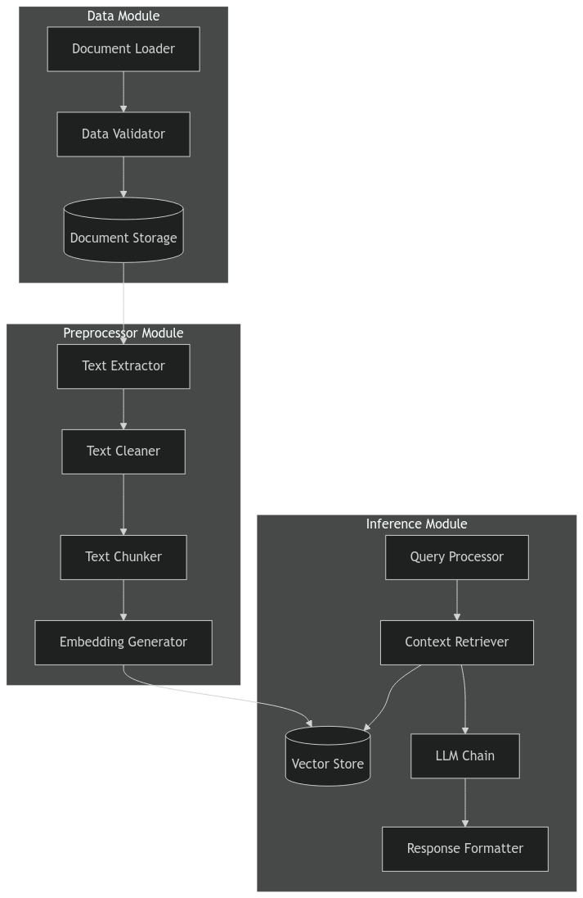

# Document Q&A LLM Application

A scalable application for document processing and question-answering using Large Language Models (LLM) and LangChain.

## Architecture


The application follows a modular architecture with three main components:

### 1. Data Module
- Handles document loading and validation
- Manages raw document storage
- Supports multiple document formats (PDF, DOCX, TXT)

### 2. Preprocessor Module
- Extracts text from documents
- Cleans and normalizes text content
- Splits text into manageable chunks
- Generates embeddings for text chunks

### 3. Inference Module
- Processes user queries
- Retrieves relevant context using vector similarity
- Generates responses using LLM
- Formats and returns responses

## Project Structure
```
src/
├── data/
│   ├── __init__.py
│   ├── loader.py      # Document loading functionality
│   ├── validator.py   # Data validation
│   └── storage.py     # Document storage management
├── preprocessor/
│   ├── __init__.py
│   ├── extractor.py   # Text extraction
│   ├── cleaner.py     # Text cleaning
│   ├── splitter.py    # Text chunking
│   └── embeddings.py  # Embedding generation
├── inference/
│   ├── __init__.py
│   ├── query.py       # Query processing
│   ├── retriever.py   # Context retrieval
│   ├── llm_chain.py   # LLM chain management
│   └── formatter.py   # Response formatting
├── config/
│   └── settings.py    # Configuration settings
└── utils/
    ├── logger.py      # Logging utilities
    └── exceptions.py  # Custom exceptions
```

## Installation

1. Clone the repository:
```bash
git clone https://github.com/yourusername/doc-qa-llm.git
cd doc-qa-llm
```

2. Create a virtual environment:
```bash
python -m venv venv
source venv/bin/activate  # On Windows: venv\Scripts\activate
```

3. Install dependencies:
```bash
pip install -r requirements.txt
```

4. Set up environment variables:
```bash
cp .env.example .env
# Edit .env with your configuration
```

## Requirements
```
langchain>=0.0.200
openai>=0.27.0
python-dotenv>=0.19.0
fastapi>=0.68.0
pydantic>=1.8.2
uvicorn>=0.15.0
python-multipart>=0.0.5
```

## Usage

1. Start the application:
```bash
python main.py
```

2. API Endpoints:
- `POST /documents`: Upload a document
- `POST /query`: Submit a question
- `GET /documents/{doc_id}`: Retrieve document status

## Configuration

Key configuration options in `config/settings.py`:
```python
SUPPORTED_FORMATS = ['pdf', 'docx', 'txt']
MAX_DOCUMENT_SIZE = 10 * 1024 * 1024  # 10MB
CHUNK_SIZE = 1000
CHUNK_OVERLAP = 200
EMBEDDING_MODEL = "text-embedding-ada-002"
LLM_MODEL = "gpt-3.5-turbo"
```

## Development

1. Install development dependencies:
```bash
pip install -r requirements-dev.txt
```

2. Run tests:
```bash
pytest tests/
```

3. Format code:
```bash
black src/
```

## Contributing

1. Fork the repository
2. Create a feature branch
3. Commit changes
4. Push to the branch
5. Create a Pull Request

## License

This project is licensed under the MIT License - see the LICENSE file for details.